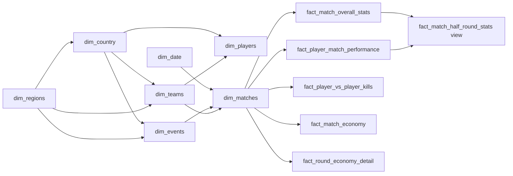

# Snowflake data model

> Warehouse contract for dims + facts in Supabase (`valorant` schema).  
> Use this file to track **what is done**, **what is still required**, and **which source feeds which table**.  
> Dagster runs daily: upsert dims first, then facts. dbt models live in `src/backend/sql/models/marts/`.

**Last updated:** 2026-08-18  
**Stage:** dims agreed; facts listed but **not locked** — define fact grains/columns organically next.

---

## Source rule

1. **rib.gg first** — current matches, round-level, replay, economy, performance.
2. **vlr.gg for anything rib.gg does not have** — historical years (2021–2025), catalogs (agents / maps / weapons names), extra team/player/event coverage.
3. **Do not use valorant-api.com.**

| Coverage | rib.gg | vlr.gg |
|----------|--------|--------|
| Current events / matches (2026+) | Yes | Yes |
| Previous years | No (new site is 2026-only) | Yes |
| Round-by-round, economy, replay kills | Yes (when stats exist) | **No** |
| Agent / map / weapon catalog | No (`/api/agents` 404; `/api/agents/stats` is meta only) | Names, images, roles from match/event pages |

`dim_matches.data_source` = `rib` | `vlr` | `both`. Round-level facts only load when the series has rib stats.

---

## How to read this file

| Status | Meaning |
|--------|---------|
| Done | Columns + source are agreed; extract exists in `ribgg.ipynb` / landing |
| Required | Needed for the model; source or load not finished |
| Static | Rare updates (agents / maps / weapons / economy / date / region / country) |
| View | dbt view from fact/dim joins — not loaded by Dagster |
| Deferred | Fact tables: names only until we define them from real extracts |

Every **table** (not views) gets:

- `row_number` — warehouse PK from **that table’s own sequence** (`START 1`, `MAXVALUE 999999999999`)
- `insert_date` — `timestamptz`, set once on insert
- `update_date` — `timestamptz`, set on insert and every Dagster upsert
- Dims may hold **names, ids, text, FKs**
- Facts hold **only dim FKs + metrics / binaries / numbers** (no names)

`row_number` never changes after insert. Source ids (`rib_match_id`, `vlr_match_id`, …) live on dims as unique business keys.

```sql
-- pattern for every table (not views)
CREATE SEQUENCE valorant.seq_<table>_row_number
  AS BIGINT START WITH 1 INCREMENT BY 1
  MINVALUE 1 MAXVALUE 999999999999;
```

---

## Tracker

| Table | Kind | Status | Daily Dagster? | Source |
|-------|------|--------|----------------|--------|
| `dim_regions` | dim | Required (static) | Rare | Seed + VLR/rib region labels |
| `dim_country` | dim | Required (static) | Rare | Seed + VLR/rib country labels |
| `dim_matches` | dim | Done (extract) / warehouse stub | Yes | rib.gg events → matches; VLR for prior years |
| `dim_events` | dim | Required | Yes | rib.gg `/events` RSC; VLR events for history |
| `dim_players` | dim | Required | Yes | rib.gg roster; VLR player/team pages |
| `dim_agents` | dim | Required (static) | Rare | VLR (rib has no catalog) |
| `dim_maps` | dim | Required (static) | Rare | VLR (rib has no catalog) |
| `dim_teams` | dim | Required | Yes | rib.gg teams; VLR teams |
| `dim_economy` | dim | Required (static) | Rare | Seed list (buy types) |
| `dim_weapons` | dim | Required (static) | Rare | VLR names when present; round weapon use still incomplete on rib |
| `dim_date` | dim | Required (static) | Rare (extend range) | Generated calendar |
| `fact_match_overall_stats` | fact | Deferred | Yes (when defined) | rib scoreboard; VLR map stats for history (no rounds) |
| `fact_match_half_round_stats` | **view** | Deferred | No | Join existing facts/dims (not a loaded table) |
| `fact_player_match_performance` | fact | Deferred | Yes (when defined) | rib Performance; VLR match stats if available |
| `fact_player_vs_player_kills` | fact | Deferred | Yes (when defined) | rib replay only (VLR has no kill events) |
| `fact_match_economy` | fact | Deferred | Yes (when defined) | rib only |
| `fact_round_economy_detail` | fact | Deferred | Yes (when defined) | rib only |

---

## Snowflake relationships

Facts sit in the middle. Dims can point at other dims (snowflake).



Grain note: `dim_matches` is one **series** (BO1/BO3/BO5).  
Map-level facts (when defined) take `map_id` → `dim_maps` and `map_game_number` as a number. Source map key like `270-m1` stays on landing, not as text on facts.

---

## Shared dim columns

Add these on **every dim table**, at the end of the column list:

| Column | Type | Why |
|--------|------|-----|
| `row_number` | `BIGINT` PK | Sequence for this dim only |
| `insert_date` | `TIMESTAMPTZ` | First load |
| `update_date` | `TIMESTAMPTZ` | Last Dagster upsert |

---

## Dimensions

### `dim_regions` — Required (static)

One row per competitive region.  
**PK:** `row_number`  
**Business key:** `region_code`  
**Sequence:** `seq_dim_regions_row_number`

| Column | Type | Notes |
|--------|------|--------|
| `region_code` | `TEXT` | `americas` / `emea` / `pacific` / `china` / `global` |
| `region_name` | `TEXT` | |
| `row_number` | `BIGINT` PK | |
| `insert_date` | `TIMESTAMPTZ` | |
| `update_date` | `TIMESTAMPTZ` | |

**Insert from:** seed. Align labels with rib.gg / VLR region strings.  
**Dagster:** rare.

---

### `dim_country` — Required (static)

One row per country.  
**PK:** `row_number`  
**Business key:** `country_code` (ISO 3166-1 alpha-2 when known)  
**Sequence:** `seq_dim_country_row_number`

| Column | Type | Notes |
|--------|------|--------|
| `country_code` | `TEXT` | `US`, `KR`, … |
| `country_name` | `TEXT` | |
| `region_id` | `BIGINT` FK | → `dim_regions.row_number` (nullable if unclear) |
| `row_number` | `BIGINT` PK | |
| `insert_date` | `TIMESTAMPTZ` | |
| `update_date` | `TIMESTAMPTZ` | |

**Insert from:** seed + countries seen on VLR/rib team and player pages.  
**Dagster:** rare; add new countries when they appear.

---

### `dim_matches` — Done (extract)

One row per series (the “match” on rib.gg / VLR).  
**PK:** `row_number`  
**Business key:** `rib_match_id` and/or `vlr_match_id` (at least one)  
**Sequence:** `seq_dim_matches_row_number`

| Column | Type | Notes |
|--------|------|--------|
| `rib_match_id` | `BIGINT` | Nullable for VLR-only history |
| `vlr_match_id` | `TEXT` | Nullable for rib-only rows |
| `data_source` | `TEXT` | `rib` / `vlr` / `both` |
| `event_id` | `BIGINT` FK | → `dim_events.row_number` |
| `team_1_id` | `BIGINT` FK | → `dim_teams.row_number` |
| `team_2_id` | `BIGINT` FK | → `dim_teams.row_number` |
| `match_date_id` | `BIGINT` FK | → `dim_date.row_number` |
| `event_series` | `TEXT` | Stage / bracket |
| `best_of` | `INT` | 1 / 3 / 5 |
| `team_1_score` | `INT` | Series maps won |
| `team_2_score` | `INT` | Series maps won |
| `match_note` | `TEXT` | Optional |
| `match_patch` | `TEXT` | When known |
| `n_maps` | `INT` | |
| `is_completed` | `BOOLEAN` | |
| `has_stats` | `BOOLEAN` | |
| `has_vod` | `BOOLEAN` | |
| `has_round_data` | `BOOLEAN` | True only when rib round/replay exists |
| `row_number` | `BIGINT` PK | |
| `insert_date` | `TIMESTAMPTZ` | |
| `update_date` | `TIMESTAMPTZ` | |

**Insert from:** rib.gg RSC events → matches (`matches_df.csv`) for current; VLR match lists for previous years.  
**Dagster:** daily upsert. Prefer rib id when both exist.

---

### `dim_events` — Required

One row per tournament / event.  
**PK:** `row_number`  
**Business key:** `rib_event_id` and/or `vlr_event_id`  
**Sequence:** `seq_dim_events_row_number`

| Column | Type | Notes |
|--------|------|--------|
| `rib_event_id` | `BIGINT` | Nullable for VLR-only history |
| `vlr_event_id` | `TEXT` | Nullable for rib-only |
| `parent_event_id` | `BIGINT` FK | → `dim_events.row_number` (nullable) |
| `region_id` | `BIGINT` FK | → `dim_regions.row_number` |
| `country_id` | `BIGINT` FK | → `dim_country.row_number` (nullable) |
| `event_name` | `TEXT` | |
| `short_name` | `TEXT` | |
| `slug` | `TEXT` | |
| `event_tier` | `TEXT` | VCT / GC / T3 / … |
| `status` | `TEXT` | upcoming / ongoing / completed |
| `start_date_id` | `BIGINT` FK | → `dim_date.row_number` |
| `end_date_id` | `BIGINT` FK | → `dim_date.row_number` |
| `prize_pool` | `NUMERIC` | |
| `prize_pool_currency` | `TEXT` | |
| `logo_url` | `TEXT` | |
| `row_number` | `BIGINT` PK | |
| `insert_date` | `TIMESTAMPTZ` | |
| `update_date` | `TIMESTAMPTZ` | |

**Insert from:** rib.gg `/events` RSC; VLR events for history and gaps.  
**Dagster:** daily upsert.

---

### `dim_players` — Required

One row per player.  
**PK:** `row_number`  
**Business key:** `rib_player_id` and/or `vlr_player_id`  
**Sequence:** `seq_dim_players_row_number`

| Column | Type | Notes |
|--------|------|--------|
| `rib_player_id` | `BIGINT` | Nullable for VLR-only |
| `vlr_player_id` | `TEXT` | Nullable for rib-only |
| `current_team_id` | `BIGINT` FK | → `dim_teams.row_number` |
| `country_id` | `BIGINT` FK | → `dim_country.row_number` |
| `ign` | `TEXT` | |
| `first_name` | `TEXT` | |
| `last_name` | `TEXT` | |
| `role` | `TEXT` | player / coach |
| `is_igl` | `BOOLEAN` | |
| `image_url` | `TEXT` | |
| `twitch_url` | `TEXT` | |
| `twitter_url` | `TEXT` | |
| `row_number` | `BIGINT` PK | |
| `insert_date` | `TIMESTAMPTZ` | |
| `update_date` | `TIMESTAMPTZ` | |

**Insert from:** rib.gg match roster / team pages; VLR player and team pages.  
**Dagster:** daily upsert.

---

### `dim_agents` — Required (static)

One row per playable agent. Additions ~1–2× / year.  
**PK:** `row_number`  
**Business key:** `agent_name` (normalized lower-case) until a stable VLR id exists  
**Sequence:** `seq_dim_agents_row_number`

| Column | Type | Notes |
|--------|------|--------|
| `vlr_agent_key` | `TEXT` | Slug / image key from VLR when present |
| `agent_name` | `TEXT` | |
| `role_name` | `TEXT` | When VLR shows it |
| `image_url` | `TEXT` | VLR agent portrait |
| `row_number` | `BIGINT` PK | |
| `insert_date` | `TIMESTAMPTZ` | |
| `update_date` | `TIMESTAMPTZ` | |

rib.gg `/api/agents` = 404. `/api/agents/stats` is pick/win **meta**, not this dim.  
VLR does not publish full ability text; do not pull that from other APIs.  
**Insert from:** distinct agents on VLR match/event agent pages.  
**Dagster:** rare.

---

### `dim_maps` — Required (static)

One row per map. Additions ~1× / year.  
**PK:** `row_number`  
**Business key:** `map_name` (normalized)  
**Sequence:** `seq_dim_maps_row_number`

| Column | Type | Notes |
|--------|------|--------|
| `vlr_map_key` | `TEXT` | When present |
| `map_name` | `TEXT` | Split, Ascent, … |
| `image_url` | `TEXT` | VLR map image if present |
| `row_number` | `BIGINT` PK | |
| `insert_date` | `TIMESTAMPTZ` | |
| `update_date` | `TIMESTAMPTZ` | |

rib.gg has no map catalog. Replay `bounds` is per match, not this dim.  
VLR does not publish world x/y multipliers; leave those off.  
**Insert from:** distinct maps on VLR/rib match pages.  
**Dagster:** rare.

---

### `dim_teams` — Required

One row per org / team.  
**PK:** `row_number`  
**Business key:** `rib_team_id` and/or `vlr_team_id`  
**Sequence:** `seq_dim_teams_row_number`

| Column | Type | Notes |
|--------|------|--------|
| `rib_team_id` | `BIGINT` | Nullable for VLR-only |
| `vlr_team_id` | `TEXT` | Nullable for rib-only |
| `region_id` | `BIGINT` FK | → `dim_regions.row_number` |
| `country_id` | `BIGINT` FK | → `dim_country.row_number` |
| `team_name` | `TEXT` | |
| `team_code` | `TEXT` | Short name |
| `logo_url` | `TEXT` | |
| `team_href` | `TEXT` | rib.gg / VLR url |
| `division` | `TEXT` | VCT / VCL / GC / T3 |
| `coach_player_id` | `BIGINT` FK | → `dim_players.row_number` (nullable) |
| `row_number` | `BIGINT` PK | |
| `insert_date` | `TIMESTAMPTZ` | |
| `update_date` | `TIMESTAMPTZ` | |

**Insert from:** rib.gg team pages / match payload; VLR teams (`vlr.orlandomm.net` or vlr.gg scrape).  
**Dagster:** daily upsert.

---

### `dim_economy` — Required (static)

One row per buy type. Seeded, not scraped.  
**PK:** `row_number`  
**Business key:** `economy_code`  
**Sequence:** `seq_dim_economy_row_number`

| Column | Type | Notes |
|--------|------|--------|
| `economy_code` | `TEXT` | `pistol` / `eco` / `semi` / `full` / `force` |
| `economy_name` | `TEXT` | |
| `min_loadout` | `INT` | Inclusive credits |
| `max_loadout` | `INT` | Inclusive credits |
| `row_number` | `BIGINT` PK | |
| `insert_date` | `TIMESTAMPTZ` | |
| `update_date` | `TIMESTAMPTZ` | |

**Insert from:** seed CSV / SQL. Used later by round-economy facts (rib only).  
**Dagster:** load once; skip if unchanged.

---

### `dim_weapons` — Required (static)

One row per gun name we see. Rare additions.  
**PK:** `row_number`  
**Business key:** `weapon_name` (normalized)  
**Sequence:** `seq_dim_weapons_row_number`

| Column | Type | Notes |
|--------|------|--------|
| `vlr_weapon_key` | `TEXT` | When present |
| `weapon_name` | `TEXT` | |
| `category` | `TEXT` | Rifle / SMG / … if VLR/rib shows it |
| `image_url` | `TEXT` | |
| `row_number` | `BIGINT` PK | |
| `insert_date` | `TIMESTAMPTZ` | |
| `update_date` | `TIMESTAMPTZ` | |

No fire-rate / accuracy catalog on rib or VLR. Do not fill that from other APIs.  
Round-level “which gun got the kill” on rib is still incomplete.  
**Insert from:** distinct weapon names on VLR/rib pages when they appear.  
**Dagster:** rare.

---

### `dim_date` — Required (static)

One row per calendar day.  
**PK:** `row_number`  
**Business key:** `date_key` (`YYYYMMDD` int)  
**Sequence:** `seq_dim_date_row_number`

| Column | Type | Notes |
|--------|------|--------|
| `date_key` | `INT` | `20260818` |
| `full_date` | `DATE` | |
| `year` | `INT` | |
| `quarter` | `INT` | |
| `month` | `INT` | |
| `month_name` | `TEXT` | |
| `day` | `INT` | |
| `day_of_week` | `INT` | 1=Mon … 7=Sun |
| `day_name` | `TEXT` | |
| `is_weekend` | `BOOLEAN` | |
| `row_number` | `BIGINT` PK | |
| `insert_date` | `TIMESTAMPTZ` | |
| `update_date` | `TIMESTAMPTZ` | |

**Insert from:** generated (e.g. 2020-01-01 through 2030-12-31).  
**Dagster:** extend once a year, or when `max(full_date)` is near.

---

## Facts (deferred)

Do **not** lock columns yet. We will define each fact from real rib/VLR extracts.  
Shared rule when we do: dim FKs + metrics/binaries/numbers only; own `row_number` sequence; `insert_date` / `update_date`.

| Fact | Planned grain | Source | Round data? |
|------|---------------|--------|-------------|
| `fact_match_overall_stats` | player × map game (scoreboard) | rib first; VLR map/player stats for history | No |
| `fact_player_match_performance` | player × map game (2k, 1vX, …) | rib Performance; VLR if the same stats exist | No |
| `fact_player_vs_player_kills` | one kill event | rib `/api/matches/{id}/replay-data` only | Yes — rib only |
| `fact_match_economy` | player × map game totals | rib Overview economy | Yes — rib only |
| `fact_round_economy_detail` | team × round × map game | rib Economy `roundEconomy` | Yes — rib only |

VLR history fills overall (and maybe performance) facts without rounds. Leave kill / economy / round facts empty for VLR-only series (`has_round_data = false`).

### `fact_match_half_round_stats` — view (not a table)

No sequence. No Dagster load. No `row_number` / timestamps.

Build later as a **dbt view** from fact + dim joins (attack vs defense half).  
Exact SQL waits until the underlying facts exist.

---

## Dagster daily pipeline

Order: dims before facts. Independent extracts in parallel.

```text
1. dim_date, dim_regions, dim_country, dim_economy   (noop if unchanged)
2. Parallel static:      dim_agents, dim_maps, dim_weapons   (VLR)
3. Parallel daily dims:  dim_events, dim_teams               (rib + VLR)
4. dim_players           (needs teams + country)
5. dim_matches           (needs events + teams + date)
6. Facts — skip until defined organically
7. Views (dbt):          fact_match_half_round_stats when its facts exist
8. dbt tests: PK unique, FK not null, grain unique
```

Upsert rule (tables only):

1. Look up business key (rib id preferred, else VLR id).
2. If new → next `row_number` from that table’s sequence, set both timestamps.
3. If exists → update attributes, set `update_date` only. **Never change `row_number`.**

Landing path: `data/<source>/<entity>/dt=YYYY-MM-DD/` with `source` = `rib_gg` or `vlr`.

---

## Downstream graphs (not tables)

These read from the warehouse after facts exist. Frontend not started.

| Graph | Primary tables |
|-------|----------------|
| K/D/A race line | `fact_match_overall_stats` + `dim_players` + `dim_date` |
| Player profile: kills race | `fact_match_overall_stats` |
| Stats per agent / map | `fact_match_overall_stats` + `dim_agents` + `dim_maps` |
| Radar per match | overall + performance facts |
| Bar: kills / deaths / assists | `fact_match_overall_stats` |
| Beeswarm | `fact_match_overall_stats` |
| Most similar players | performance fact (later) |
| Win / loss for player | overall `is_winner` |
| Match report | overall + view + economy + PvP (rib matches only for rounds) |
| Player / team comparison | same facts |
| Team profile | `dim_teams` + facts |
| Event prize / standings / agents | `dim_events` + overall |
| Map dashboard attack/defense | `fact_match_half_round_stats` view |
| Map-pick losses | `dim_matches` + overall |

---

## Open gaps

- Do not use valorant-api.com. Agent abilities, map coordinates, and gun fire-rate/accuracy are **out of scope** unless VLR or rib later expose them.
- VLR history has **no** round-by-round, economy, or kill replay.
- Weapon on a kill row may stay null even on rib.
- Old `be-prod.rib.gg` is dead; do not plan loads from it.
- Current dbt marts are dummy stubs. Replace them from this file, starting with dims.
- Do not store Riot / API keys in this file. Use `.env` only.
