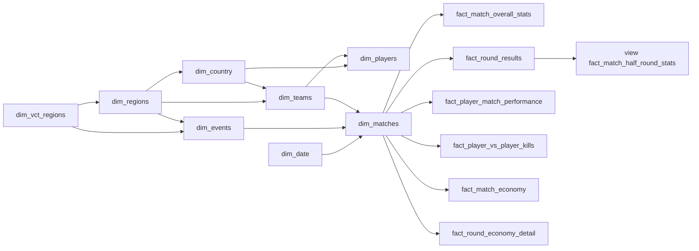

# Snowflake data model

> Warehouse contract for dims + facts in Supabase (`valorant` schema).  
> Use this file to track **what is done**, **what is still required**, and **which API feeds which table**.  
> Dagster runs daily: upsert dims first, then facts. dbt models live in `src/backend/sql/models/marts/`.

**Last updated:** 2026-09-17

---

## Source strategy


| Role         | Source                                                                                                           | What it owns                                                                                                                                             |
| ------------ | ---------------------------------------------------------------------------------------------------------------- | -------------------------------------------------------------------------------------------------------------------------------------------------------- |
| **Primary**  | [vlr.gg](https://www.vlr.gg) via **self-hosted** [axsddlr/vlrggapi](https://github.com/axsddlr/vlrggapi) (`/v2`) | Historical + current events, series, maps, teams, players, scoreboard, performance, economy, round **win** timeline, kill matrix. Covers previous years. |
| Overlay  | rib.gg RSC `/matches/{id}` + `/api/matches/{id}/replay-data` | Round player table, economy, replay kills/events/**snapshots**. Join to VLR by **event name + team names + date** (fuzzy). Snapshots upsert into `vlr.fact_rib_replay_snapshot`. |
| **Not used** | valorant-api.com, public `vlrggapi.vercel.app` (down), orlandomm (503)                                           | Dropped as live hosts.                                                                                                                                   |


VLR IDs are the business keys (same ids as vlr.gg URLs). rib.gg ids are optional overlay keys after fuzzy join.

**Self-host:** `docker compose up vlrggapi` → `http://127.0.0.1:3001` (image `ghcr.io/axsddlr/vlrggapi:latest`). Public Vercel host is **down** (free-tier). [README](https://github.com/axsddlr/vlrggapi).

**VLR wrapper endpoints (GET,** `/v2`**):**


| Path                           | Feeds                                       |
| ------------------------------ | ------------------------------------------- |
| `/v2/events?q=completed&page=` | `dim_events` list                           |
| `/v2/event/{id}`               | event detail, prizes, participating rosters |
| `/v2/events/matches?event_id=` | `dim_matches`                               |
| `/v2/match/details?match_id=`  | maps, players, rounds, performance, economy |
| `/v2/match?q=results`          | completed match feed                        |
| `/v2/player?id=&q=profile`     | `dim_players`                               |
| `/v2/team?id=&q=profile`       | `dim_teams` + roster                        |
| `/v2/rankings?region=`         | seed teams/countries by region              |
| `/v2/search?q=`                | resolve names → ids                         |
| `/v2/health`                   | container health                            |


This wrapper is **richer** than [vlresports](https://vlresports.vercel.app/teams/get-all-teams) (orlandomm): match details include rounds, kill matrix, economy, CT/T scores. No `limit=all` teams list — teams come from rankings + event rosters + match payloads.

Dagster talks to `http://vlrggapi:3001` inside Compose (`VLR_API_BASE`).

---


## How to read this file


| Status      | Meaning                                                                |
| ----------- | ---------------------------------------------------------------------- |
| Done        | Columns + source are agreed; extract exists in `ribgg.ipynb` / landing |
| Required    | Needed for the model; source or load not finished                      |
| Static      | Rare updates (agents / maps / weapons / economy / date)                |
| Not started | No warehouse load yet (dbt stubs only)                                 |


Every table gets:

- `row_number` — warehouse PK from **that table’s own sequence** (`START 1`, `MAXVALUE 999999999999`)
- `insert_date` — `timestamptz`, set once on insert
- `update_date` — `timestamptz`, set on insert and every Dagster upsert
- Dims may hold **names, ids, text, FKs**
- Facts hold **only dim FKs + metrics / binaries / numbers** (no names)

`row_number` never changes after insert. Source ids (`vlr_match_id`, `vlr_player_id`, `rib_match_id`, …) live on dims as unique business keys. **VLR id is primary.** rib id is nullable overlay.

```sql
-- pattern for every table
CREATE SEQUENCE valorant.seq_<table>_row_number
  AS BIGINT START WITH 1 INCREMENT BY 1
  MINVALUE 1 MAXVALUE 999999999999;
```

---


## Tracker


| Table                           | Kind     | Status                                 | Daily Dagster?      | Source                                                                  |
| ------------------------------- | -------- | -------------------------------------- | ------------------- | ----------------------------------------------------------------------- |
| `dim_vct_regions`               | dim      | Seed job `vlr_dims`                    | Rare                | Seed `src/backend/vlr/regions.py`                                       |
| `dim_regions`                   | dim      | Seed job `vlr_dims`                    | Rare                | Seed local ranking codes                                                |
| `dim_country`                   | dim      | Seed job `vlr_dims`                    | Rare                | Distinct flags on `events.jsonl` rosters                                |
| `dim_matches`                   | dim      | Required                               | Yes                 | `/v2/events/matches` + `/v2/match/details`                              |
| `dim_events`                    | dim      | Required                               | Yes                 | `/v2/events`, `/v2/event/{id}`                                          |
| `dim_players`                   | dim      | Job `vlr_players`                      | Yes                 | `/v2/player?id=&q=profile`; ids from event + team rosters               |
| `dim_teams`                     | dim      | Job `vlr_teams`                        | Yes                 | `/v2/team?id=&q=profile` + rankings overlay; ids from event/match jsonl |
| `dim_agents`                    | dim      | Job `vlr_agents` (also in `vlr_dims`)  | Rare (new agent)    | valorant-api.com kit + Liquipedia AbilityCard (AWS rotator)             |
| `dim_maps`                      | dim      | Job `vlr_maps` (also in `vlr_dims`)    | Rare (new map)      | valorant-api.com radar + Liquipedia Infobox map (AWS rotator)           |
| `dim_economy`                   | dim      | Seed job `vlr_dims`                    | Rare                | Seed buy types                                                          |
| `dim_weapons`                   | dim      | Job `vlr_weapons` (also in `vlr_dims`) | Rare (new gun)      | valorant.fandom.com Infobox + TTK (AWS rotator)                         |
| `dim_date`                      | dim      | Seed job `vlr_date`                    | Rare (extend range) | Generated calendar 2020–2030                                            |
| `fact_match_overall_stats`      | fact     | Job `vlr_facts` (code ready, not run)  | Yes                 | `matches.jsonl` player box score                                        |
| `fact_player_match_performance` | fact     | Job `vlr_facts`                        | Yes                 | KAST/HS/FK + series 2K/1vX on map 1                                     |
| `fact_round_results`            | fact     | Job `vlr_facts`                        | Yes                 | `maps[].rounds[]`                                                       |
| `fact_map_game_results`         | fact     | Job `vlr_facts`                        | Yes                 | Team-map rounds + attack/defense halves                                 |
| `fact_series_team_result`       | fact     | Job `vlr_facts`                        | Yes                 | Team series W/L                                                         |
| `fact_match_economy`            | fact     | Job `vlr_facts`                        | Yes                 | Pistol/eco/full played vs won                                           |
| `fact_round_economy_detail`     | fact     | Job `vlr_facts`                        | Yes                 | Bank/loadout when `round_economy` is on the landing                     |
| `fact_map_veto`                 | fact     | Job `vlr_facts`                        | Yes                 | Ban/pick/decider from `map_vetos`                                       |
| `fact_match_half_round_stats`   | **view** | dbt later                              | n/a                 | Aggregate `fact_round_results`                                          |
| `fact_rib_round`                | fact     | Job `rib_facts`                        | Yes (rib)           | Round winner + win type from rib RSC                                    |
| `fact_rib_round_player`         | fact     | Job `rib_facts`                        | Yes (rib)           | Per-round weapon/armor/loadout/ACS/K/A/damage/HS%                       |
| `fact_rib_round_economy`        | fact     | Job `rib_facts`                        | Yes (rib)           | Team bank/loadout/buy tier                                              |
| `fact_player_vs_player_kills`   | fact     | Job `rib_facts`                        | Yes (rib)           | Replay kills (time + positions)                                         |
| `fact_rib_replay_event`         | fact     | Job `rib_facts`                        | Yes (rib)           | Non-snapshot events (kill/plant/defuse/ability)                         |
| `fact_rib_replay_snapshot`      | fact     | Job `rib_facts`                        | Yes (rib)           | Position ticks (`type=snapshot`)                                        |
| `fact_rib_match_crosswalk`      | fact     | Job `rib_facts`                        | Yes (rib)           | Fuzzy rib → VLR series join                                             |
| `vlr.ops_pipeline_watermarks`   | ops      | Job `vlr_daily` / every inc DAG        | Yes                 | One row per pipeline+table; `last_source_at` timestamptz                |


VLR does **not** have replay (kills/positions). It **does** have round winners + attack/defense side on the match page. That is enough for the half-round **view**.

---


## Snowflake relationships

Facts sit in the middle. Dims can point at other dims (snowflake), not only at facts.




Grain note: `dim_matches` is one **series** (BO1/BO3/BO5) keyed by **vlr_match_id**.  
Map-level facts take `map_id` → `dim_maps` and `map_game_number` (1, 2, 3…).

---


## Shared dim columns

Add these on **every dim**, in this order at the ends of the column list:


| Column        | Type          | Why                        |
| ------------- | ------------- | -------------------------- |
| `row_number`  | `BIGINT` PK   | Sequence for this dim only |
| `insert_date` | `TIMESTAMPTZ` | First load                 |
| `update_date` | `TIMESTAMPTZ` | Last Dagster upsert        |


---


## Dimensions


### `dim_vct_regions` — Required (static)

One row per **VCT international circuit**. Do not put `na` / `eu` / `kr` here.  
**PK:** `row_number`  
**Business key:** `vct_region_code`  
**Sequence:** `seq_dim_vct_regions_row_number`


| Column            | Type          | Notes                                  |
| ----------------- | ------------- | -------------------------------------- |
| `vct_region_code` | `TEXT`        | `americas`, `emea`, `pacific`, `china` |
| `vct_region_name` | `TEXT`        |                                        |
| `row_number`      | `BIGINT` PK   |                                        |
| `insert_date`     | `TIMESTAMPTZ` |                                        |
| `update_date`     | `TIMESTAMPTZ` |                                        |


**Insert from:** seed in `src/backend/vlr/regions.py` (`VCT_REGIONS`).  
**Dagster:** load once with `dim_regions`.

---


### `dim_regions` — Required (static)

One row per **local VLR ranking code**. Do not put `americas` / `emea` / `pacific` / `china` here.  
**PK:** `row_number`  
**Business key:** `region_code`  
**Sequence:** `seq_dim_regions_row_number`


| Column            | Type          | Notes                                                                     |
| ----------------- | ------------- | ------------------------------------------------------------------------- |
| `region_code`     | `TEXT`        | `na`, `eu`, `br`, `ap`, `kr`, `ch`, `jp`, `lan`, `las`, `oce`, `mn`, `gc` |
| `region_name`     | `TEXT`        |                                                                           |
| `vct_region_code` | `TEXT`        | FK business key → `dim_vct_regions` (null for `gc`)                       |
| `row_number`      | `BIGINT` PK   |                                                                           |
| `insert_date`     | `TIMESTAMPTZ` |                                                                           |
| `update_date`     | `TIMESTAMPTZ` |                                                                           |


**Insert from:** seed in `src/backend/vlr/regions.py` (`LOCAL_REGIONS`). API aliases: `cn`→`ch`, `la-n`→`lan`, `la-s`→`las`.  
**Dagster:** load once.

Rule: a row is **either** a VCT circuit **or** a local code. Events store at most one of `vct_region_id` / `region_id`. Teams store local `region_code` from rankings overlay (profile has no region); `region_id` FK later. Circuit is via `dim_regions.vct_region_code`.

---


### `dim_country` — Required

One row per country string VLR uses.  
**PK:** `row_number`  
**Business key:** `country_name` (or code if we later normalize)  
**Sequence:** `seq_dim_country_row_number`


| Column         | Type          | Notes                                             |
| -------------- | ------------- | ------------------------------------------------- |
| `country_name` | `TEXT`        | As returned by VLR (`United States`, …)           |
| `region_id`    | `BIGINT` FK   | → `dim_regions.row_number` (local only, nullable) |
| `row_number`   | `BIGINT` PK   |                                                   |
| `insert_date`  | `TIMESTAMPTZ` |                                                   |
| `update_date`  | `TIMESTAMPTZ` |                                                   |


**Insert from:** distinct `country` on `/teams` and `/players`.  
**Dagster:** daily upsert on `country_name`.

---


### `dim_matches` — Required

One row per series (the “match” on vlr.gg).  
**PK:** `row_number`  
**Business key:** `vlr_match_id` (unique)  
**Sequence:** `seq_dim_matches_row_number`


| Column           | Type          | Notes                         |
| ---------------- | ------------- | ----------------------------- |
| `vlr_match_id`   | `TEXT`        | vlr.gg URL id                 |
| `rib_match_id`   | `BIGINT`      | Overlay when joined; nullable |
| `event_id`       | `BIGINT` FK   | → `dim_events.row_number`     |
| `team_1_id`      | `BIGINT` FK   | → `dim_teams.row_number`      |
| `team_2_id`      | `BIGINT` FK   | → `dim_teams.row_number`      |
| `match_date_id`  | `BIGINT` FK   | → `dim_date.row_number`       |
| `event_series`   | `TEXT`        | Stage / bracket               |
| `best_of`        | `INT`         | 1 / 3 / 5                     |
| `team_1_score`   | `INT`         | Series maps won               |
| `team_2_score`   | `INT`         | Series maps won               |
| `match_note`     | `TEXT`        | Optional (picks/bans note)    |
| `match_patch`    | `TEXT`        | When known                    |
| `n_maps`         | `INT`         |                               |
| `is_completed`   | `BOOLEAN`     |                               |
| `has_stats`      | `BOOLEAN`     |                               |
| `has_vod`        | `BOOLEAN`     |                               |
| `has_rib_replay` | `BOOLEAN`     | True when overlay loaded      |
| `row_number`     | `BIGINT` PK   |                               |
| `insert_date`    | `TIMESTAMPTZ` |                               |
| `update_date`    | `TIMESTAMPTZ` |                               |


**Landing now:** job `vlr_matches` writes `data/vlr/matches.jsonl` (dim fields + `listing` + full `/v2/match/details`). Later facts/dims parse that file — do not re-hit the API.  
**Warehouse now:** codes (`vlr_event_id`, `vlr_team_1_id`, `vlr_team_2_id`) and `match_date` TEXT `YYYY/M/D`. Resolve FKs after `dim_teams` / `dim_date` exist.  
**Dagster:** upsert on `vlr_match_id`. Set `rib_match_id` when overlay job matches.

---


### `dim_events` — Required

One row per tournament / event.  
**PK:** `row_number`  
**Business key:** `vlr_event_id`  
**Sequence:** `seq_dim_events_row_number`


| Column                     | Type          | Notes                                                                                      |
| -------------------------- | ------------- | ------------------------------------------------------------------------------------------ |
| `vlr_event_id`             | `TEXT`        |                                                                                            |
| `parent_event_id`          | `BIGINT` FK   | → `dim_events.row_number` (nullable)                                                       |
| `vct_region_id`            | `BIGINT` FK   | → `dim_vct_regions` when the event is a VCT circuit (Pacific Stage, Americas, …)           |
| `region_id`                | `BIGINT` FK   | → `dim_regions` when the event is local/challengers (`na`, `kr`, …)                        |
| `event_name`               | `TEXT`        |                                                                                            |
| `short_name`               | `TEXT`        |                                                                                            |
| `slug`                     | `TEXT`        |                                                                                            |
| `event_tier`               | `TEXT`        | vct / vcl / t3 / game-changers / …                                                         |
| `status`                   | `TEXT`        | upcoming / ongoing / completed                                                             |
| `start_date_id`            | `BIGINT` FK   | → `dim_date.row_number` (later; landing uses `start_date` TEXT `YYYY/M/D` e.g. `2026/7/8`) |
| `end_date_id`              | `BIGINT` FK   | → `dim_date.row_number` (later; landing uses `end_date` TEXT `YYYY/M/D`)                   |
| `prize_pool`               | `NUMERIC`     |                                                                                            |
| `prize_pool_currency`      | `TEXT`        |                                                                                            |
| `logo_url`                 | `TEXT`        |                                                                                            |
| `url`                      | `TEXT`        | vlr.gg event page                                                                          |
| `series`                   | `TEXT`        | Circuit line (`Valorant Champions Tour 2026`)                                              |
| `subtitle`                 | `TEXT`        |                                                                                            |
| `location`                 | `TEXT`        | Venue / city                                                                               |
| `dates_text`               | `TEXT`        | Raw VLR date string                                                                        |
| `prize_pool_text`          | `TEXT`        | Raw prize string                                                                           |
| `participating_team_count` | `INT`         |                                                                                            |
| `prize_placement_count`    | `INT`         |                                                                                            |
| `prizes_json`              | `JSONB`       | Place / amount / team                                                                      |
| `teams_json`               | `JSONB`       | Participating rosters                                                                      |
| `standings_json`           | `JSONB`       | Empty on many live events                                                                  |
| `row_number`               | `BIGINT` PK   |                                                                                            |
| `insert_date`              | `TIMESTAMPTZ` |                                                                                            |
| `update_date`              | `TIMESTAMPTZ` |                                                                                            |


**Insert from:** job `vlr_events` (`/v2/events` + `/v2/event/{id}`). Classify `region` with `split_event_region`: VCT circuit **or** local code, never both. Landing: `data/vlr/events.jsonl`.  
**Dagster:** one-shot historical, then later incremental upsert on `vlr_event_id`.

---


### `dim_players` — Required

One row per player.  
**PK:** `row_number`  
**Business key:** `vlr_player_id`  
**Sequence:** `seq_dim_players_row_number`


| Column                | Type          | Notes                                                                                                                                                               |
| --------------------- | ------------- | ------------------------------------------------------------------------------------------------------------------------------------------------------------------- |
| `vlr_player_id`       | `TEXT`        |                                                                                                                                                                     |
| `rib_player_id`       | `BIGINT`      | Overlay; nullable                                                                                                                                                   |
| `ign`                 | `TEXT`        | VLR handle (`vora`)                                                                                                                                                 |
| `full_name`           | `TEXT`        | `real_name` (`Jordan Pulwer`)                                                                                                                                       |
| `first_name`          | `TEXT`        | Split from `full_name`                                                                                                                                              |
| `last_name`           | `TEXT`        | Remainder after first token                                                                                                                                         |
| `country_flag`        | `TEXT`        | `/v2/player` `country` (`ca`)                                                                                                                                       |
| `country_name`        | `TEXT`        | Mapped display name (`Canada`)                                                                                                                                      |
| `image_url`           | `TEXT`        | Avatar                                                                                                                                                              |
| `player_href`         | `TEXT`        | `https://www.vlr.gg/player/{id}`                                                                                                                                    |
| `vlr_team_id`         | `TEXT`        | Current org id (join `dim_teams`). Warehouse `current_team_id` FK later.                                                                                            |
| `current_team_name`   | `TEXT`        | Current org name (`100 Thieves`)                                                                                                                                    |
| `current_team_joined` | `TEXT`        | `joined in November 2025` → `November 2025`; null if unknown                                                                                                        |
| `social_links_json`   | `JSONB`       | `{"twitter": "https://x.com/vorazune", "twitch": null}`. Keys are always `twitter` / `twitch`; missing link is null. Header twitter needs vlrggapi overlay rebuild. |
| `teams_json`          | `JSONB`       | Current + past: `[{"vlr_team_id","team_name","joined_at","left_at","status"}]`. `left_at` is null while current / unknown.                                          |
| `row_number`          | `BIGINT` PK   |                                                                                                                                                                     |
| `insert_date`         | `TIMESTAMPTZ` |                                                                                                                                                                     |
| `update_date`         | `TIMESTAMPTZ` |                                                                                                                                                                     |


**Insert from:** `/v2/player?id=&q=profile`. Team id from profile `current_team.id` / `past_teams[].id` after overlay, else unique `team_name` match on `teams.jsonl`. Id universe from event rosters + `teams.jsonl` roster.  
**Dagster:** job `vlr_players` daily upsert on `vlr_player_id`.

---


### `dim_agents` — Required (static)

One row per playable agent. Kit catalog (abilities, costs, portraits) plus any extra names seen on VLR scoreboards.  
**PK:** `row_number`  
**Business key:** `agent_name`  
**Sequence:** `seq_dim_agents_row_number`


| Column                  | Type          | Notes                                                                                                                                                                                                                                                                                            |
| ----------------------- | ------------- | ------------------------------------------------------------------------------------------------------------------------------------------------------------------------------------------------------------------------------------------------------------------------------------------------ |
| `agent_name`            | `TEXT`        | Riot / VLR spelling (`Jett`, `KAY/O`). Scoreboard `KAYO` canonicalizes to `KAY/O`.                                                                                                                                                                                                               |
| `role_name`             | `TEXT`        | Duelist / Initiator / Controller / Sentinel from valorant-api.com                                                                                                                                                                                                                                |
| `description`           | `TEXT`        | Short bio from valorant-api.com                                                                                                                                                                                                                                                                  |
| `real_name`             | `TEXT`        | Liquipedia Infobox (`Sunwoo Han`)                                                                                                                                                                                                                                                                |
| `country_name`          | `TEXT`        | Liquipedia Infobox (`South Korea`)                                                                                                                                                                                                                                                               |
| `release_date`          | `TEXT`        | Liquipedia `YYYY-MM-DD` (API uses `1970-01-01` for launch roster)                                                                                                                                                                                                                                |
| `face_url`              | `TEXT`        | Agent face / scoreboard icon (`displayIcon`)                                                                                                                                                                                                                                                     |
| `image_url`             | `TEXT`        | Same as `face_url`                                                                                                                                                                                                                                                                               |
| `bust_url`              | `TEXT`        | valorant-api `bustPortrait`                                                                                                                                                                                                                                                                      |
| `killfeed_portrait_url` | `TEXT`        | valorant-api `killfeedPortrait`                                                                                                                                                                                                                                                                  |
| `portrait_url`          | `TEXT`        | valorant-api `fullPortrait`                                                                                                                                                                                                                                                                      |
| `role_icon_url`         | `TEXT`        | valorant-api role icon                                                                                                                                                                                                                                                                           |
| `valorant_api_uuid`     | `TEXT`        | Riot agent uuid                                                                                                                                                                                                                                                                                  |
| `liquipedia_url`        | `TEXT`        | `https://liquipedia.net/valorant/{name}`                                                                                                                                                                                                                                                         |
| `ability_c_name`        | `TEXT`        | C (grenade) ability name                                                                                                                                                                                                                                                                         |
| `ability_c_cost`        | `INTEGER`     | Credits; `0` = Free                                                                                                                                                                                                                                                                              |
| `ability_q_name`        | `TEXT`        | Q ability name                                                                                                                                                                                                                                                                                   |
| `ability_q_cost`        | `INTEGER`     | Credits; `0` = Free                                                                                                                                                                                                                                                                              |
| `ability_e_name`        | `TEXT`        | E (signature) ability name from live valorant-api slot `Ability2`                                                                                                                                                                                                                                |
| `ability_e_cost`        | `INTEGER`     | Always `0` — signature is not bought                                                                                                                                                                                                                                                             |
| `ultimate_name`         | `TEXT`        | X ultimate name                                                                                                                                                                                                                                                                                  |
| `ultimate_orbs`         | `INTEGER`     | Ult points (Liquipedia `ultimatecost`)                                                                                                                                                                                                                                                           |
| `abilities_json`        | `JSONB`       | Liquipedia AbilityCard + API icons. Keys: `kind` (Passive/Basic/Signature/Ultimate), `name`, `hotkey` / `hotkey_pc` / `hotkey_ps` / `hotkey_xbox`, `cost_credits`, `ultimate_orbs`, `uses`, `charges`, `windup`, `duration`, `cooldown`, `debuff`, `regain`, `description`, `icon_url`, `stats`. |
| `tags_json`             | `JSONB`       | valorant-api `characterTags` (string list; often empty)                                                                                                                                                                                                                                          |
| `row_number`            | `BIGINT` PK   |                                                                                                                                                                                                                                                                                                  |
| `insert_date`           | `TIMESTAMPTZ` |                                                                                                                                                                                                                                                                                                  |
| `update_date`           | `TIMESTAMPTZ` |                                                                                                                                                                                                                                                                                                  |


**Insert from:** AWS-rotated GET `https://valorant-api.com/v1/agents?isPlayableCharacter=true` (face, portraits, ability names/icons, live slots). Credit costs, uses, windup/duration/cooldown, ult orbs from Liquipedia `AbilityCard` matched **by ability name**, not by wiki hotkey (Liquipedia can lag kit reworks; Harbor is Q High Tide / E Cove). Slots: Grenade=C, Ability1=Q, Ability2=E (signature, cost always 0), Ultimate=X. Host IP is never used.  
**Dagster:** job `vlr_agents` (also in `vlr_dims`). Full catalog upsert on `agent_name`. Rematerialize when Riot ships a new agent or reworks a kit. `dims_from_landings` only inserts new scoreboard names and does not wipe kit columns.

---


### `dim_maps` — Required (static)

One row per playable map. Location / lore from Liquipedia; radar x/y from valorant-api.com. Extra names seen on VLR scoreboards stay as thin rows until the catalog job runs.  
**PK:** `row_number`  
**Business key:** `map_name`  
**Sequence:** `seq_dim_maps_row_number`


| Column                                | Type               | Notes                                                                                         |
| ------------------------------------- | ------------------ | --------------------------------------------------------------------------------------------- |
| `map_name`                            | `TEXT`             | Split, Ascent, …                                                                              |
| `country_name`                        | `TEXT`             | Liquipedia Infobox (`Morocco`)                                                                |
| `location_name`                       | `TEXT`             | e.g. `MA Rabat, Rabat-Salé-Kénitra, Morocco`                                                  |
| `earth_name`                          | `TEXT`             | `Alpha Earth` or `Omega Earth`                                                                |
| `coordinates_text`                    | `TEXT`             | Lore string (`34°2'A" N 6°51'Z" W`)                                                           |
| `latitude`                            | `DOUBLE PRECISION` | Decimal degrees; lore A/Z seconds → 0                                                         |
| `longitude`                           | `DOUBLE PRECISION` | Decimal degrees                                                                               |
| `spike_sites`                         | `TEXT`             | `A/B` or `A/B/C`                                                                              |
| `map_features`                        | `TEXT`             | Teleporters, one-way doors, …                                                                 |
| `description`                         | `TEXT`             | Official blurb (`Two sites. No middle…`) from LP Quote or valorant-api `narrativeDescription` |
| `release_date`                        | `TEXT`             | Liquipedia                                                                                    |
| `minimap_url`                         | `TEXT`             | valorant-api `displayIcon`                                                                    |
| `splash_url`                          | `TEXT`             | valorant-api splash                                                                           |
| `list_view_icon_url`                  | `TEXT`             |                                                                                               |
| `x_multiplier`                        | `DOUBLE PRECISION` | Radar math (valorant-api)                                                                     |
| `y_multiplier`                        | `DOUBLE PRECISION` |                                                                                               |
| `x_scalar`                            | `DOUBLE PRECISION` | `xScalarToAdd`                                                                                |
| `y_scalar`                            | `DOUBLE PRECISION` | `yScalarToAdd`                                                                                |
| `min_x` / `min_y` / `max_x` / `max_y` | `DOUBLE PRECISION` | Callout world-coordinate bounds (map size)                                                    |
| `valorant_api_uuid`                   | `TEXT`             |                                                                                               |
| `liquipedia_url`                      | `TEXT`             |                                                                                               |
| `callouts_json`                       | `JSONB`            | `[{region_name, super_region_name, x, y}]`                                                    |
| `features_json`                       | `JSONB`            | Feature list                                                                                  |
| `infobox_json`                        | `JSONB`            | Remaining Liquipedia Infobox keys                                                             |
| `row_number`                          | `BIGINT` PK        |                                                                                               |
| `insert_date`                         | `TIMESTAMPTZ`      |                                                                                               |
| `update_date`                         | `TIMESTAMPTZ`      |                                                                                               |


**Insert from:** AWS-rotated GET `https://valorant-api.com/v1/maps` + Liquipedia `Infobox map` / `Quote`. Host IP is never used.  
**Dagster:** job `vlr_maps` (also in `vlr_dims`). Rematerialize when Riot ships a new map. `dims_from_landings` only inserts new scoreboard names.

---


### `dim_teams` — Required

One row per org / team.  
**PK:** `row_number`  
**Business key:** `vlr_team_id`  
**Sequence:** `seq_dim_teams_row_number`


| Column                   | Type          | Notes                                                                                                              |
| ------------------------ | ------------- | ------------------------------------------------------------------------------------------------------------------ |
| `vlr_team_id`            | `TEXT`        |                                                                                                                    |
| `rib_team_id`            | `BIGINT`      | Overlay; nullable                                                                                                  |
| `region_code`            | `TEXT`        | Local ranking code when known. Profile has no region; overlay from `/v2/rankings`. Warehouse `region_id` FK later. |
| `country_name`           | `TEXT`        | `/v2/team` `country_name` (already on landing + dim). Warehouse `country_id` FK later.                             |
| `country_flag`           | `TEXT`        | `/v2/team` `country` (`us`, `kr`, …)                                                                               |
| `team_name`              | `TEXT`        |                                                                                                                    |
| `team_code`              | `TEXT`        | Short tag (`GEN`)                                                                                                  |
| `logo_url`               | `TEXT`        | `img`                                                                                                              |
| `team_href`              | `TEXT`        | `https://www.vlr.gg/team/{id}`                                                                                     |
| `division`               | `TEXT`        | When known (not on team profile today)                                                                             |
| `current_roster_json`    | `JSONB`       | Active players only: `[{"vlr_player_id","ign"}, …]`. Join on `vlr_player_id`.                                      |
| `coaches_json`           | `JSONB`       | Head/other coaches (not assistants): `[{"vlr_player_id","ign","role"}, …]`.                                        |
| `assistant_coaches_json` | `JSONB`       | Assistant coaches, same object shape.                                                                              |
| `coach_vlr_player_id`    | `TEXT`        | Head coach id (first `head coach`, else first coaches_json row).                                                   |
| `social_links_json`      | `JSONB`       | Org links `[{"platform","url"}, …]`. Drops vlr.gg chrome (`vlrdotgg`, `discord.com/invite/VLR`).                   |
| `row_number`             | `BIGINT` PK   |                                                                                                                    |
| `insert_date`            | `TIMESTAMPTZ` |                                                                                                                    |
| `update_date`            | `TIMESTAMPTZ` |                                                                                                                    |


**Insert from:** `/v2/team?id=&q=profile` (current roster is on that payload; classify players vs coach vs assistant coach by `role`, because `is_staff` is often wrong and `q=roster` `staff` is empty). Rankings overlay `region_code` by name+country (rankings often lack team id). Id universe from `/v2/event/{id}` rosters + match team ids.  
**Dagster:** job `vlr_teams` daily upsert on `vlr_team_id`. Store TEXT codes now; resolve `region_id` / `country_id` / `coach_player_id` `row_number` FKs after those dims are complete.

---


### `dim_economy` — Required (static)

One row per buy type. Seeded, not scraped.  
**PK:** `row_number`  
**Business key:** `economy_code`  
**Sequence:** `seq_dim_economy_row_number`


| Column         | Type          | Notes                                        |
| -------------- | ------------- | -------------------------------------------- |
| `economy_code` | `TEXT`        | `pistol` / `eco` / `semi` / `full` / `force` |
| `economy_name` | `TEXT`        |                                              |
| `min_loadout`  | `INT`         | Inclusive credits                            |
| `max_loadout`  | `INT`         | Inclusive credits                            |
| `row_number`   | `BIGINT` PK   |                                              |
| `insert_date`  | `TIMESTAMPTZ` |                                              |
| `update_date`  | `TIMESTAMPTZ` |                                              |


**Insert from:** seed CSV / SQL. Map round `loadout` credits → this dim in the fact load.  
**Dagster:** load once; skip if unchanged.

---


### `dim_weapons` — Fandom catalog

One row per competitive weapon (sidearms, SMGs, shotguns, rifles, snipers, LMGs, melee). VLR match JSON has **no gun names**.  
**PK:** `row_number`  
**Business key:** `weapon_name`  
**Sequence:** `seq_dim_weapons_row_number`


| Column              | Type          | Notes                                                                                                                                                                             |
| ------------------- | ------------- | --------------------------------------------------------------------------------------------------------------------------------------------------------------------------------- |
| `weapon_name`       | `TEXT`        | Classic, Vandal, …                                                                                                                                                                |
| `weapon_type`       | `TEXT`        | Sidearm / SMG / Shotgun / Rifle / Sniper Rifle / Machine Gun / Melee                                                                                                              |
| `credits`           | `INT`         | Shop cost; `0` = Free                                                                                                                                                             |
| `wall_penetration`  | `TEXT`        | Low / Medium / High                                                                                                                                                               |
| `length`            | `TEXT`        | Canon length (`30.92 cm`)                                                                                                                                                         |
| `creator`           | `TEXT`        | Manufacturer (`Falcon`)                                                                                                                                                           |
| `quote`             | `TEXT`        | Fandom `{{Quote1}}` tagline                                                                                                                                                       |
| `image_url`         | `TEXT`        | Full weapon render                                                                                                                                                                |
| `icon_url`          | `TEXT`        | Shop / HUD icon                                                                                                                                                                   |
| `killfeed_icon_url` | `TEXT`        | Killfeed icon                                                                                                                                                                     |
| `fire_rate`         | `FLOAT`       | Primary rounds/sec (first number)                                                                                                                                                 |
| `magazine_size`     | `INT`         |                                                                                                                                                                                   |
| `fandom_url`        | `TEXT`        | `https://valorant.fandom.com/wiki/{name}`                                                                                                                                         |
| `rib_weapon_id`     | `TEXT`        | Optional leftover rib.gg id                                                                                                                                                       |
| `fire_stats_json`   | `JSONB`       | `{primary_fire, alternate_fire, spread}`. Primary/alt hold fire mode, rate, damage bands, TTK at 100/125/150 HP. Spread is first-shot / max / movement penalties per firing mode. |
| `row_number`        | `BIGINT` PK   |                                                                                                                                                                                   |
| `insert_date`       | `TIMESTAMPTZ` |                                                                                                                                                                                   |
| `update_date`       | `TIMESTAMPTZ` |                                                                                                                                                                                   |


**Insert from:** AWS-rotated MediaWiki `https://valorant.fandom.com/api.php` (`Weapons` list + each `Infobox weapon` page + `imageinfo` URLs). Host IP is never used. Skips Golden Gun / Snowball Launcher.  
**Dagster:** job `vlr_weapons` (also in `vlr_dims`). Rare upsert on `weapon_name`. Rematerialize when Riot ships a new gun.

---


### `dim_date` — Required (static)

One row per calendar day. Join events/matches on `project_date` (`YYYY/M/D`) or `full_date`.  
**PK:** `row_number`  
**Business key:** `date_key` (`YYYYMMDD` int)  
**Sequence:** `seq_dim_date_row_number`


| Column                                | Type          | Notes                                    |
| ------------------------------------- | ------------- | ---------------------------------------- |
| `date_key`                            | `INT`         | `20260708` — numeric BETWEEN             |
| `full_date`                           | `DATE`        | Native date BETWEEN                      |
| `project_date`                        | `TEXT`        | `2026/7/8` — join event/match text dates |
| `year`                                | `INT`         |                                          |
| `quarter`                             | `INT`         | 1–4                                      |
| `month`                               | `INT`         | 1–12                                     |
| `day`                                 | `INT`         | 1–31                                     |
| `day_of_year`                         | `INT`         | 1–366                                    |
| `day_of_week`                         | `INT`         | ISO 1=Mon … 7=Sun                        |
| `week_of_year`                        | `INT`         | ISO week 1–53                            |
| `iso_year`                            | `INT`         | ISO week-year (Jan 1 can be prior year)  |
| `week_of_month`                       | `INT`         | 1–5                                      |
| `month_name`                          | `TEXT`        | July                                     |
| `month_short`                         | `TEXT`        | Jul                                      |
| `day_name`                            | `TEXT`        | Wednesday                                |
| `day_short`                           | `TEXT`        | Wed                                      |
| `year_month`                          | `INT`         | `202607` — BETWEEN months                |
| `year_month_text`                     | `TEXT`        | `2026/7`                                 |
| `year_quarter`                        | `INT`         | `20263` — BETWEEN quarters               |
| `year_quarter_text`                   | `TEXT`        | `2026-Q3`                                |
| `year_half`                           | `INT`         | 1=Jan–Jun, 2=Jul–Dec                     |
| `year_half_text`                      | `TEXT`        | `2026-H2`                                |
| `iso_week_num`                        | `INT`         | `202628` — BETWEEN ISO weeks             |
| `iso_week_key`                        | `TEXT`        | `2026-W28`                               |
| `decade`                              | `INT`         | `2020`                                   |
| `days_in_month`                       | `INT`         |                                          |
| `week_start` / `week_end`             | `DATE`        | ISO Mon–Sun window                       |
| `month_start` / `month_end`           | `DATE`        |                                          |
| `quarter_start` / `quarter_end`       | `DATE`        |                                          |
| `half_start` / `half_end`             | `DATE`        |                                          |
| `year_start` / `year_end`             | `DATE`        |                                          |
| `is_weekend`                          | `BOOLEAN`     | Sat/Sun                                  |
| `is_week_start` / `is_week_end`       | `BOOLEAN`     | Mon / Sun                                |
| `is_month_start` / `is_month_end`     | `BOOLEAN`     |                                          |
| `is_quarter_start` / `is_quarter_end` | `BOOLEAN`     |                                          |
| `is_half_start` / `is_half_end`       | `BOOLEAN`     |                                          |
| `is_year_start` / `is_year_end`       | `BOOLEAN`     |                                          |
| `row_number`                          | `BIGINT` PK   |                                          |
| `insert_date`                         | `TIMESTAMPTZ` |                                          |
| `update_date`                         | `TIMESTAMPTZ` |                                          |


**Insert from:** generated 2020-01-01 through 2030-12-31 (`VLR_DATE_START` / `VLR_DATE_END`). Job `vlr_date`.  
**Range filters:** `year` / `year_quarter` / `year_month` / `iso_week_num` equality or BETWEEN; or `full_date BETWEEN month_start AND month_end` after joining one day.  
**Dagster:** load once; extend the end date when needed.

---


## Shared fact columns

Every fact, in this order at the ends:


| Column        | Type          | Why                         |
| ------------- | ------------- | --------------------------- |
| `row_number`  | `BIGINT` PK   | Sequence for this fact only |
| `insert_date` | `TIMESTAMPTZ` | First load                  |
| `update_date` | `TIMESTAMPTZ` | Last upsert                 |


All fact grain keys are TEXT source ids (`vlr_match_id`, `vlr_team_id`, `vlr_player_id`, …).  
`map_game_number` and `round_number` are integers (degenerate), not dims.  
Upsert is a **composite unique** on those grain columns — not a concatenated `fact_key` string.

---


## Facts

Facts live in schema `vlr`. Grain keys are **TEXT source ids** (same pattern as dims), not `dim_*.row_number` FKs. dbt can join later. Besides keys: **metrics and booleans only**. Every table has `row_number`, `insert_date`, `update_date`, and a **composite unique** on the grain columns.

Parse from in-memory match details on the incremental job `vlr_facts` (or `vlr_daily`). Historical jsonl path remains `vlr_hist_facts`. Scoreboard has no player id; incremental facts resolve `vlr_player_id` from warehouse `dim_players` / `dim_teams`.

### `fact_match_overall_stats` — **start here** (website)

Grain: **one player on one map game**. Box score.  
Composite unique: `(vlr_match_id, map_game_number, vlr_team_id, vlr_player_id)`.  
`map_game_number` is in the key so a BO3 does not collapse maps. `player_name` is a label, not a key.

### `fact_player_match_performance`

Grain: **one player on one map game**. KAST, HS%, FK/FD. Multi-kills / 1vX / econ / plants / defuses from series `advanced_stats` **on map 1 only** (VLR does not split them per map).  
Composite unique: `(vlr_match_id, map_game_number, vlr_team_id, vlr_player_id)` (same as overall).

### `fact_round_results`

Grain: **one round of one map game**. Winner team + `is_attack_win`. `win_method_code` is null on current `/v2` rounds.  
Composite unique: `(vlr_match_id, map_game_number, round_number)`.

### `fact_map_game_results`

Grain: **one team on one map game**. Rounds won/lost, T/CT half rounds, duration, map pick.  
Composite unique: `(vlr_match_id, map_game_number, vlr_team_id)`.

### `fact_series_team_result`

Grain: **one team on one series**. Maps won/lost, series winner.  
Composite unique: `(vlr_match_id, vlr_team_id)`.

### `fact_match_economy`

Grain: **one team on one series**. Pistol/eco/semi/full **played vs won** (`7 (4)` → played 7, won 4).  
Composite unique: `(vlr_match_id, vlr_team_id)`.

### `fact_round_economy_detail`

Grain: **one team on one round**. Bank/loadout when `maps[].round_economy` is present (often empty until economy-tab scrape is on the landing).  
Composite unique: `(vlr_match_id, map_game_number, round_number, vlr_team_id)`.

### `fact_map_veto`

Grain: **one veto action**. Ban / pick / decider from `map_vetos` text.  
Composite unique: `(vlr_match_id, action_order)`.

### `fact_match_half_round_stats` — dbt view (later)

Grain: team × map × attack/defense. Built from `fact_round_results`.

### `fact_player_vs_player_kills` — rib overlay

Grain: one kill from replay. Job `rib_facts`.

### `fact_rib_round` / `fact_rib_round_player` / `fact_rib_round_economy` / `fact_rib_replay_event` / `fact_rib_replay_snapshot`

Round winner + per-player loadout/combat + team economy + replay events + **position ticks** (`type=snapshot` → `fact_rib_replay_snapshot`). Keys include both `rib_*` and `vlr_*` ids after fuzzy join. Replay JSON also stays under `data/rib_gg/json/replay/` so load can retry.

### `fact_rib_match_crosswalk`

Grain: one rib series. Fuzzy join to `vlr_match_id` on event name + team names + date.

See `LATER.md` for economy dim / KG agent / close-the-VLR-load.

## Incremental pipelines

Every live VLR DAG is four steps:

1. **check watermark** — read `vlr.ops_pipeline_watermarks` for that pipeline+table
2. **extract** — pull since `last_source_at` into memory (daily volume is small)
3. **merge** — upsert those rows into Supabase
4. **update watermark** — always write the attempt; success may advance `last_source_at`; failure never does

Table grain: `(pipeline_name, table_name)`. Columns: `source_name`, `last_source_at`, `last_success_at`, `last_attempt_at`, `row_count`, `dagster_run_id`, `dagster_job_name`, `status`, `error_text`, plus `row_number` / `insert_date` / `update_date`.

**Minus 1 hour:** `last_source_at` is timestamptz, so overlap of 1 hour covers late stats and clock skew. VLR event/match dates are date-only (`2026/9/16`), so extract also keeps the whole calendar day of `since`. Catalogs (date/agents/maps/weapons/economy) have no source event time — full small upsert, watermark is `last_success_at` only.

**First incremental run** bootstraps `since` from `MAX(update_date)` on that warehouse table so history is not rescanned. Empty table → `VLR_INC_BOOTSTRAP_DAYS` (default 7).

Jobs: `vlr_events`, `vlr_matches`, `vlr_teams`, `vlr_players`, `vlr_facts` (4 steps each). Chain: `vlr_daily` (events → matches → teams → players → facts). One-shot jsonl backfills: `vlr_hist_*`.

## Dagster daily pipeline (Docker)

Run extract + dbt from the **Dockerfile / compose**, not a laptop venv. Order:

```text
1. dim_date, dim_vct_regions, dim_regions, dim_economy     (seed / extend; full small upsert + watermark)
2. Job `vlr_daily` (or the five 4-step jobs in order):
     events → matches → teams → players → facts
     each: watermark → in-memory extract since last_source_at-1h → merge → watermark
3. Optional catalogs: `vlr_agents` / `vlr_maps` / `vlr_weapons`
4. rib overlay job `rib_facts` (unchanged)
5. dbt later: views/tests on live `vlr.fact_*` (not the dummy `valorant` stubs)
```

Jobs:

- `vlr_daily` — **main incremental** (events → matches → teams → players → facts)
- `vlr_events` / `vlr_matches` / `vlr_teams` / `vlr_players` / `vlr_facts` — 4-step DAGs
- `vlr_hist_*` — one-shot jsonl backfills (do not use for daily)
- `rib_facts` — overlay: RSC match + replay JSON → `vlr.fact_rib_*` + kills
- `rib_gg_star_schema_job` — **legacy** be-prod parquet (stale API)

Upsert rule: business key = VLR id. New row → next `row_number`. Never change `row_number`.

Landing: `data/vlr/<entity>/dt=YYYY-MM-DD/` and `data/rib_gg/<entity>/dt=YYYY-MM-DD/`.

---


## Downstream graphs (not tables)

These read from the warehouse. Frontend not started.


| Graph                            | Primary tables                                               |
| -------------------------------- | ------------------------------------------------------------ |
| K/D/A race line                  | `fact_match_overall_stats` + `dim_players` + `dim_date`      |
| Player profile: kills race       | `fact_match_overall_stats`                                   |
| Stats per agent / map            | `fact_match_overall_stats` + `dim_agents` + `dim_maps`       |
| Radar per match                  | `fact_match_overall_stats` + `fact_player_match_performance` |
| Bar: kills / deaths / assists    | `fact_match_overall_stats`                                   |
| Beeswarm                         | `fact_match_overall_stats`                                   |
| Most similar players             | `fact_player_match_performance` (later model)                |
| Win / loss for player            | `fact_match_overall_stats.is_winner`                         |
| Match report                     | overall + half + economy + PvP facts                         |
| Player / team comparison         | same facts, two `player_id` / `team_id` filters              |
| Team profile                     | `dim_teams` + facts                                          |
| Event prize / standings / agents | `dim_events` + `fact_match_overall_stats`                    |
| Map dashboard attack/defense     | `fact_match_half_round_stats`                                |
| Map-pick losses                  | `fact_map_veto` + `fact_map_game_results`                    |


---


## Open gaps

- Compose includes **vlrggapi**; `vlr_star_schema_job` extracts dims + facts then loads `vlr.`* and builds the half-round dbt view.
- `src/backend/vlr/extract.py` lands catalog + overall/round/performance/economy parquet.
- rib overlay join is **fuzzy**: event name + team names + date.
- `fact_player_vs_player_kills` is empty for historical VLR-only matches (no replay).
- `fact_round_economy_detail` is scraped from the VLR economy tab (`scrape_economy.py`); `/v2` still only has the buy-win table.
- `/v2/match/details` omits `event_id` (resolve via `/v2/search` or events/matches) and Attack/Defend player splits (`.side.mod-both` only).
- Performance 2K–1v5 / ECON / PL / DE and economy buy columns arrive as keys `"1"`…`"13"` / `"0"`…`"5"` — remap in `src/backend/vlr/field_maps.py`.
- Incremental extract cursor: `vlr.ops_pipeline_watermarks` (`pipeline_name`, `table_name`, `last_source_at`). Legacy JSON `data/vlr/watermarks.json` is per-entity fetch history only.
- `dim_maps` and `dim_agents` are kit catalogs (valorant-api.com + Liquipedia, AWS rotator). `dim_weapons` is the Fandom gun catalog (AWS rotator).
- Current dbt dim stubs in schema `valorant` are still dummy; live facts load into schema `vlr`.
- Do not store API keys in this file. Use `.env` only.

