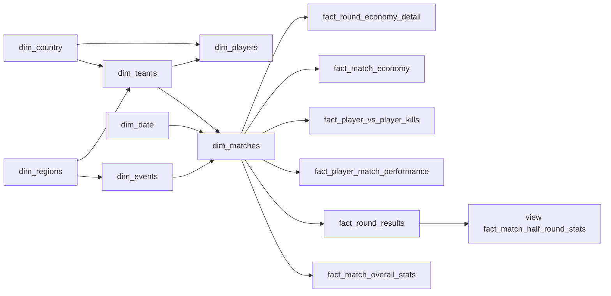

# Snowflake data model

> Warehouse contract for dims + facts in Supabase (`valorant` schema).  
> Use this file to track **what is done**, **what is still required**, and **which API feeds which table**.  
> Dagster runs daily: upsert dims first, then facts. dbt models live in `src/backend/sql/models/marts/`.

**Last updated:** 2026-09-04

---

## Source strategy

| Role | Source | What it owns |
|------|--------|----------------|
| **Primary** | [vlr.gg](https://www.vlr.gg) via **self-hosted** [axsddlr/vlrggapi](https://github.com/axsddlr/vlrggapi) (`/v2`) | Historical + current events, series, maps, teams, players, scoreboard, performance, economy, round **win** timeline, kill matrix. Covers previous years. |
| **Overlay** | rib.gg `/api/matches/{id}/replay-data` | Replay kills, positions. Join to VLR by **event name + team names + date** (fuzzy). |
| **Not used** | valorant-api.com, public `vlrggapi.vercel.app` (down), orlandomm (503) | Dropped as live hosts. |

VLR IDs are the business keys (same ids as vlr.gg URLs). rib.gg ids are optional overlay keys after fuzzy join.

**Self-host:** `docker compose up vlrggapi` → `http://127.0.0.1:3001` (image `ghcr.io/axsddlr/vlrggapi:latest`). Public Vercel host is **down** (free-tier). [README](https://github.com/axsddlr/vlrggapi).

**VLR wrapper endpoints (GET, `/v2`):**

| Path | Feeds |
|------|--------|
| `/v2/events?q=completed&page=` | `dim_events` list |
| `/v2/event/{id}` | event detail, prizes, participating rosters |
| `/v2/events/matches?event_id=` | `dim_matches` |
| `/v2/match/details?match_id=` | maps, players, rounds, performance, economy |
| `/v2/match?q=results` | completed match feed |
| `/v2/player?id=&q=profile` | `dim_players` |
| `/v2/team?id=&q=profile` | `dim_teams` + roster |
| `/v2/rankings?region=` | seed teams/countries by region |
| `/v2/search?q=` | resolve names → ids |
| `/v2/health` | container health |

This wrapper is **richer** than [vlresports](https://vlresports.vercel.app/teams/get-all-teams) (orlandomm): match details include rounds, kill matrix, economy, CT/T scores. No `limit=all` teams list — teams come from rankings + event rosters + match payloads.

Dagster talks to `http://vlrggapi:3001` inside Compose (`VLR_API_BASE`).

---

## How to read this file

| Status | Meaning |
|--------|---------|
| Done | Columns + source are agreed; extract exists in `ribgg.ipynb` / landing |
| Required | Needed for the model; source or load not finished |
| Static | Rare updates (agents / maps / weapons / economy / date) |
| Not started | No warehouse load yet (dbt stubs only) |

Every table gets:

- `row_number` — warehouse PK from **that table’s own sequence** (`START 1`, `MAXVALUE 999999999999`)
- `insert_date` — `timestamptz`, set once on insert
- `update_date` — `timestamptz`, set on insert and every Dagster upsert
- Dims may hold **names, ids, text, FKs**
- Facts hold **only dim FKs + metrics / binaries / numbers** (no names)

`row_number` never changes after insert. Source ids (`vlr_match_id`, `vlr_player_id`, `rib_match_id`, …) live on dims as unique business keys. **VLR id is primary.** rib id is nullable overlay.

```sql
-- pattern for every table
CREATE SEQUENCE valorant.seq_<table>_row_number
  AS BIGINT START WITH 1 INCREMENT BY 1
  MINVALUE 1 MAXVALUE 999999999999;
```

---

## Tracker

| Table | Kind | Status | Daily Dagster? | Source |
|-------|------|--------|----------------|--------|
| `dim_regions` | dim | Required (static) | Rare | Seed from VLR region codes (`na`, `eu`, `ap`, …) |
| `dim_country` | dim | Required | Yes | Distinct `country` on VLR teams/players |
| `dim_matches` | dim | Required | Yes | `/v2/events/matches` + `/v2/match/details` |
| `dim_events` | dim | Required | Yes | `/v2/events`, `/v2/event/{id}` |
| `dim_players` | dim | Required | Yes | `/v2/player` + team rosters |
| `dim_teams` | dim | Required | Yes | `/v2/team` + `/v2/rankings` + event rosters |
| `dim_agents` | dim | Required (static) | Rare | Distinct agent names from VLR match/event agents pages |
| `dim_maps` | dim | Required (static) | Rare | Distinct map names from VLR matches |
| `dim_economy` | dim | Required (static) | Rare | Seed buy types; map from VLR economy tab |
| `dim_weapons` | dim | Required (static) | Rare | Names seen on rib replay kills (nullable on facts) |
| `dim_date` | dim | Required (static) | Rare (extend range) | Generated calendar |
| `fact_match_overall_stats` | fact | Landed (parquet) | Yes | VLR `/v2/match/details` map `players[]` |
| `fact_round_results` | fact | Landed (parquet) | Yes | VLR map `rounds[]` (winner, side t/ct; **no win method**) |
| `vlr_watermarks` | ops | JSON landing | Yes | Last successful fetch per match/event/team/player (`data/vlr/watermarks.json`) |
| `fact_match_half_round_stats` | **view** | dbt view | n/a (dbt view) | Aggregate `vlr.fact_round_results` by match/map/team/side |
| `fact_player_match_performance` | fact | Landed (parquet) | Yes | Scoreboard kast/hs/fk + series `advanced_stats` on map 1 |
| `fact_player_vs_player_kills` | fact | Not started | Yes (rib only) | rib.gg replay-data; empty for historical VLR-only matches |
| `fact_match_economy` | fact | Landed (parquet) | Yes | VLR team pistol/eco/full **win %** (not player spend) |
| `fact_round_economy_detail` | fact | JSON landing | Yes | VLR economy tab `.bank` + `.rnd-sq` via `scrape_economy` (not /v2) |

VLR does **not** have replay (kills/positions). It **does** have round winners + attack/defense side on the match page. That is enough for the half-round **view**.

---

## Snowflake relationships

Facts sit in the middle. Dims can point at other dims (snowflake), not only at facts.



Grain note: `dim_matches` is one **series** (BO1/BO3/BO5) keyed by **vlr_match_id**.  
Map-level facts take `map_id` → `dim_maps` and `map_game_number` (1, 2, 3…).

---

## Shared dim columns

Add these on **every dim**, in this order at the ends of the column list:

| Column | Type | Why |
|--------|------|-----|
| `row_number` | `BIGINT` PK | Sequence for this dim only |
| `insert_date` | `TIMESTAMPTZ` | First load |
| `update_date` | `TIMESTAMPTZ` | Last Dagster upsert |

---

## Dimensions

### `dim_regions` — Required (static)

One row per VLR region code.  
**PK:** `row_number`  
**Business key:** `region_code`  
**Sequence:** `seq_dim_regions_row_number`

| Column | Type | Notes |
|--------|------|--------|
| `region_code` | `TEXT` | `na`, `eu`, `br`, `ap`, `kr`, `ch`, `jp`, `lan`, `las`, `oce`, `mn`, `gc`, `americas`, `emea`, `pacific`, `china` |
| `region_name` | `TEXT` | |
| `row_number` | `BIGINT` PK | |
| `insert_date` | `TIMESTAMPTZ` | |
| `update_date` | `TIMESTAMPTZ` | |

**Insert from:** seed SQL matching VLR `region` query params.  
**Dagster:** load once.

---

### `dim_country` — Required

One row per country string VLR uses.  
**PK:** `row_number`  
**Business key:** `country_name` (or code if we later normalize)  
**Sequence:** `seq_dim_country_row_number`

| Column | Type | Notes |
|--------|------|--------|
| `country_name` | `TEXT` | As returned by VLR (`United States`, …) |
| `region_id` | `BIGINT` FK | → `dim_regions.row_number` (nullable) |
| `row_number` | `BIGINT` PK | |
| `insert_date` | `TIMESTAMPTZ` | |
| `update_date` | `TIMESTAMPTZ` | |

**Insert from:** distinct `country` on `/teams` and `/players`.  
**Dagster:** daily upsert on `country_name`.

---

### `dim_matches` — Required

One row per series (the “match” on vlr.gg).  
**PK:** `row_number`  
**Business key:** `vlr_match_id` (unique)  
**Sequence:** `seq_dim_matches_row_number`

| Column | Type | Notes |
|--------|------|--------|
| `vlr_match_id` | `TEXT` | vlr.gg URL id |
| `rib_match_id` | `BIGINT` | Overlay when joined; nullable |
| `event_id` | `BIGINT` FK | → `dim_events.row_number` |
| `team_1_id` | `BIGINT` FK | → `dim_teams.row_number` |
| `team_2_id` | `BIGINT` FK | → `dim_teams.row_number` |
| `match_date_id` | `BIGINT` FK | → `dim_date.row_number` |
| `event_series` | `TEXT` | Stage / bracket |
| `best_of` | `INT` | 1 / 3 / 5 |
| `team_1_score` | `INT` | Series maps won |
| `team_2_score` | `INT` | Series maps won |
| `match_note` | `TEXT` | Optional (picks/bans note) |
| `match_patch` | `TEXT` | When known |
| `n_maps` | `INT` | |
| `is_completed` | `BOOLEAN` | |
| `has_stats` | `BOOLEAN` | |
| `has_vod` | `BOOLEAN` | |
| `has_rib_replay` | `BOOLEAN` | True when overlay loaded |
| `row_number` | `BIGINT` PK | |
| `insert_date` | `TIMESTAMPTZ` | |
| `update_date` | `TIMESTAMPTZ` | |

**Insert from:** VLR `/events/{id}/matches` then `/matches/{id}`.  
**Dagster:** daily upsert on `vlr_match_id`. Set `rib_match_id` when overlay job matches.

---

### `dim_events` — Required

One row per tournament / event.  
**PK:** `row_number`  
**Business key:** `vlr_event_id`  
**Sequence:** `seq_dim_events_row_number`

| Column | Type | Notes |
|--------|------|--------|
| `vlr_event_id` | `TEXT` | |
| `parent_event_id` | `BIGINT` FK | → `dim_events.row_number` (nullable) |
| `region_id` | `BIGINT` FK | → `dim_regions.row_number` |
| `event_name` | `TEXT` | |
| `short_name` | `TEXT` | |
| `slug` | `TEXT` | |
| `event_tier` | `TEXT` | vct / vcl / t3 / game-changers / … |
| `status` | `TEXT` | upcoming / ongoing / completed |
| `start_date_id` | `BIGINT` FK | → `dim_date.row_number` |
| `end_date_id` | `BIGINT` FK | → `dim_date.row_number` |
| `prize_pool` | `NUMERIC` | |
| `prize_pool_currency` | `TEXT` | |
| `logo_url` | `TEXT` | |
| `row_number` | `BIGINT` PK | |
| `insert_date` | `TIMESTAMPTZ` | |
| `update_date` | `TIMESTAMPTZ` | |

**Insert from:** VLR `/events` + `/events/{id}`.  
**Dagster:** daily upsert on `vlr_event_id`.

---

### `dim_players` — Required

One row per player.  
**PK:** `row_number`  
**Business key:** `vlr_player_id`  
**Sequence:** `seq_dim_players_row_number`

| Column | Type | Notes |
|--------|------|--------|
| `vlr_player_id` | `TEXT` | |
| `rib_player_id` | `BIGINT` | Overlay; nullable |
| `current_team_id` | `BIGINT` FK | → `dim_teams.row_number` |
| `country_id` | `BIGINT` FK | → `dim_country.row_number` |
| `ign` | `TEXT` | |
| `first_name` | `TEXT` | |
| `last_name` | `TEXT` | |
| `role` | `TEXT` | player / coach |
| `is_igl` | `BOOLEAN` | |
| `image_url` | `TEXT` | |
| `twitch_url` | `TEXT` | |
| `twitter_url` | `TEXT` | |
| `row_number` | `BIGINT` PK | |
| `insert_date` | `TIMESTAMPTZ` | |
| `update_date` | `TIMESTAMPTZ` | |

**Insert from:** VLR `/players/{id}` and `/teams/{id}` roster.  
**Dagster:** daily upsert on `vlr_player_id`.

---

### `dim_agents` — Required (static)

One row per agent **name** seen on VLR (no ability catalog).  
**PK:** `row_number`  
**Business key:** `agent_name`  
**Sequence:** `seq_dim_agents_row_number`

| Column | Type | Notes |
|--------|------|--------|
| `agent_name` | `TEXT` | VLR spelling (`Jett`, `Omen`, …) |
| `role_name` | `TEXT` | If present on event agents page; else null |
| `image_url` | `TEXT` | From match agent img |
| `row_number` | `BIGINT` PK | |
| `insert_date` | `TIMESTAMPTZ` | |
| `update_date` | `TIMESTAMPTZ` | |

**Insert from:** distinct agents on VLR `/matches/{id}` and `/events/{id}/agents`.  
**Dagster:** upsert new names as they appear.

---

### `dim_maps` — Required (static)

One row per map **name** seen on VLR.  
**PK:** `row_number`  
**Business key:** `map_name`  
**Sequence:** `seq_dim_maps_row_number`

| Column | Type | Notes |
|--------|------|--------|
| `map_name` | `TEXT` | Split, Ascent, … |
| `image_url` | `TEXT` | If VLR provides |
| `row_number` | `BIGINT` PK | |
| `insert_date` | `TIMESTAMPTZ` | |
| `update_date` | `TIMESTAMPTZ` | |

No world x/y catalog without valorant-api.com. rib replay `bounds` stay on replay facts only.  
**Insert from:** distinct `maps[].name` on VLR match detail.  
**Dagster:** upsert new names as they appear.

---

### `dim_teams` — Required

One row per org / team.  
**PK:** `row_number`  
**Business key:** `vlr_team_id`  
**Sequence:** `seq_dim_teams_row_number`

| Column | Type | Notes |
|--------|------|--------|
| `vlr_team_id` | `TEXT` | |
| `rib_team_id` | `BIGINT` | Overlay; nullable |
| `region_id` | `BIGINT` FK | → `dim_regions.row_number` |
| `country_id` | `BIGINT` FK | → `dim_country.row_number` |
| `team_name` | `TEXT` | |
| `team_code` | `TEXT` | Short name |
| `logo_url` | `TEXT` | `img` |
| `team_href` | `TEXT` | vlr.gg url |
| `division` | `TEXT` | When known |
| `coach_player_id` | `BIGINT` FK | → `dim_players.row_number` (nullable) |
| `row_number` | `BIGINT` PK | |
| `insert_date` | `TIMESTAMPTZ` | |
| `update_date` | `TIMESTAMPTZ` | |

**Insert from:** `/v2/team?id=&q=profile`, `/v2/rankings?region=`, `/v2/event/{id}` rosters.  
**Dagster:** daily upsert on `vlr_team_id`.

---

### `dim_economy` — Required (static)

One row per buy type. Seeded, not scraped.  
**PK:** `row_number`  
**Business key:** `economy_code`  
**Sequence:** `seq_dim_economy_row_number`

| Column | Type | Notes |
|--------|------|--------|
| `economy_code` | `TEXT` | `pistol` / `eco` / `semi` / `full` / `force` |
| `economy_name` | `TEXT` | |
| `min_loadout` | `INT` | Inclusive credits |
| `max_loadout` | `INT` | Inclusive credits |
| `row_number` | `BIGINT` PK | |
| `insert_date` | `TIMESTAMPTZ` | |
| `update_date` | `TIMESTAMPTZ` | |

**Insert from:** seed CSV / SQL. Map round `loadout` credits → this dim in the fact load.  
**Dagster:** load once; skip if unchanged.

---

### `dim_weapons` — Required (static)

One row per weapon **name** seen on rib replay kills. VLR has no gun catalog.  
**PK:** `row_number`  
**Business key:** `weapon_name`  
**Sequence:** `seq_dim_weapons_row_number`

| Column | Type | Notes |
|--------|------|--------|
| `weapon_name` | `TEXT` | |
| `row_number` | `BIGINT` PK | |
| `insert_date` | `TIMESTAMPTZ` | |
| `update_date` | `TIMESTAMPTZ` | |

No fire-rate / accuracy without valorant-api.com.  
**Insert from:** distinct weapon names on rib kill events.  
**Dagster:** upsert when replay overlay runs.

---

### `dim_date` — Required (static)

One row per calendar day.  
**PK:** `row_number`  
**Business key:** `date_key` (`YYYYMMDD` int)  
**Sequence:** `seq_dim_date_row_number`

| Column | Type | Notes |
|--------|------|--------|
| `date_key` | `INT` | `20260818` |
| `full_date` | `DATE` | |
| `year` | `INT` | |
| `quarter` | `INT` | |
| `month` | `INT` | |
| `month_name` | `TEXT` | |
| `day` | `INT` | |
| `day_of_week` | `INT` | 1=Mon … 7=Sun |
| `day_name` | `TEXT` | |
| `is_weekend` | `BOOLEAN` | |
| `row_number` | `BIGINT` PK | |
| `insert_date` | `TIMESTAMPTZ` | |
| `update_date` | `TIMESTAMPTZ` | |

**Insert from:** generated (e.g. 2020-01-01 through 2030-12-31).  
**Dagster:** extend once a year, or when `max(full_date)` is near.

---

## Shared fact columns

Every fact, in this order at the ends:

| Column | Type | Why |
|--------|------|-----|
| `row_number` | `BIGINT` PK | Sequence for this fact only |
| `insert_date` | `TIMESTAMPTZ` | First load |
| `update_date` | `TIMESTAMPTZ` | Last upsert |

All `*_id` columns on facts are FKs to `dim_*.row_number`.  
`map_game_number` and `round_number` are integers (degenerate), not dims.

---

## Facts

### `fact_match_overall_stats` — Landed (parquet → `vlr`)

Grain: **one player on one map game**. Scoreboard totals.  
**Sequence:** `seq_fact_match_overall_stats_row_number`  
**Business key:** `(match_id, map_id, map_game_number, player_id)`

| Column | Type | Notes |
|--------|------|--------|
| `match_id` | `BIGINT` FK | → `dim_matches` |
| `event_id` | `BIGINT` FK | → `dim_events` |
| `date_id` | `BIGINT` FK | → `dim_date` |
| `map_id` | `BIGINT` FK | → `dim_maps` |
| `map_game_number` | `INT` | 1..n in the series |
| `player_id` | `BIGINT` FK | → `dim_players` |
| `team_id` | `BIGINT` FK | → `dim_teams` |
| `agent_id` | `BIGINT` FK | → `dim_agents` |
| `kills` | `INT` | |
| `deaths` | `INT` | |
| `assists` | `INT` | |
| `plus_minus` | `INT` | |
| `acs` | `NUMERIC` | |
| `adr` | `NUMERIC` | |
| `rating` | `NUMERIC` | |
| `rounds_played` | `INT` | |
| `is_winner` | `BOOLEAN` | Map win |
| `row_number` | `BIGINT` PK | |
| `insert_date` | `TIMESTAMPTZ` | |
| `update_date` | `TIMESTAMPTZ` | |

**Insert from:** VLR `/matches/{id}` map `players[]`.  
**Dagster:** daily, completed maps.

---

### `fact_round_results` — Landed (parquet → `vlr`)

Grain: **one round of one map game**. Stored so the half-round view can aggregate.  
**Sequence:** `seq_fact_round_results_row_number`  
**Business key:** `(match_id, map_id, map_game_number, round_number)`

| Column | Type | Notes |
|--------|------|--------|
| `match_id` | `BIGINT` FK | → `dim_matches` |
| `event_id` | `BIGINT` FK | → `dim_events` |
| `date_id` | `BIGINT` FK | → `dim_date` |
| `map_id` | `BIGINT` FK | → `dim_maps` |
| `map_game_number` | `INT` | |
| `round_number` | `INT` | |
| `winning_team_id` | `BIGINT` FK | → `dim_teams` |
| `losing_team_id` | `TEXT` | Other team on the round (for half-round view) |
| `is_attack_win` | `BOOLEAN` | `side` = `t` on VLR |
| `win_method_code` | `INT` | 1=elim, 2=boom, 3=defuse, 4=time (no text on fact) |
| `row_number` | `BIGINT` PK | |
| `insert_date` | `TIMESTAMPTZ` | |
| `update_date` | `TIMESTAMPTZ` | |

**Insert from:** VLR `maps[].rounds[]` (`number`, `winner`, `side`, `method`).  
**Dagster:** daily with match detail.

---

### `fact_match_half_round_stats` — **dbt view** (`valorant.fact_match_half_round_stats`)

Grain: **one team on one map game on one side** (attack or defense).  
No sequence. Built in dbt from `fact_round_results` + dims.

| Column | Type | Notes |
|--------|------|--------|
| `match_id` | `BIGINT` FK | → `dim_matches` |
| `event_id` | `BIGINT` FK | |
| `date_id` | `BIGINT` FK | |
| `map_id` | `BIGINT` FK | |
| `map_game_number` | `INT` | |
| `team_id` | `BIGINT` FK | |
| `is_attack` | `BOOLEAN` | |
| `rounds_played` | `INT` | |
| `rounds_won` | `INT` | |

Player-level attack/defense K/D is **not** on VLR. Do not invent it. Map dashboard uses this team-side view.

---

### `fact_player_match_performance` — Landed (parquet → `vlr`)

Grain: **one player on one map game**. Extra performance counts (2k, 1vX, …).  
**Sequence:** `seq_fact_player_match_performance_row_number`  
**Business key:** `(match_id, map_id, map_game_number, player_id)`

| Column | Type | Notes |
|--------|------|--------|
| `match_id` | `BIGINT` FK | → `dim_matches` |
| `event_id` | `BIGINT` FK | → `dim_events` |
| `date_id` | `BIGINT` FK | → `dim_date` |
| `map_id` | `BIGINT` FK | → `dim_maps` |
| `map_game_number` | `INT` | |
| `player_id` | `BIGINT` FK | → `dim_players` |
| `team_id` | `BIGINT` FK | → `dim_teams` |
| `agent_id` | `BIGINT` FK | → `dim_agents` |
| `kast` | `NUMERIC` | |
| `hs_pct` | `NUMERIC` | |
| `headshots` | `INT` | |
| `bodyshots` | `INT` | |
| `legshots` | `INT` | |
| `first_kills` | `INT` | |
| `first_deaths` | `INT` | |
| `clutches` | `INT` | |
| `op_kills` | `INT` | |
| `multi_k2` | `INT` | 2ks |
| `multi_k3` | `INT` | |
| `multi_k4` | `INT` | |
| `multi_k5` | `INT` | |
| `clutch_v1` | `INT` | 1v1 wins |
| `clutch_v2` | `INT` | |
| `clutch_v3` | `INT` | |
| `clutch_v4` | `INT` | |
| `clutch_v5` | `INT` | |
| `row_number` | `BIGINT` PK | |
| `insert_date` | `TIMESTAMPTZ` | |
| `update_date` | `TIMESTAMPTZ` | |

**Insert from:** VLR `?tabs=performance` (`multikills`, clutches).  
**Dagster:** daily, completed maps.

---

### `fact_player_vs_player_kills` — Not started

Grain: **one kill event**.  
**Sequence:** `seq_fact_player_vs_player_kills_row_number`  
**Business key:** `(match_id, map_id, map_game_number, round_number, kill_time_ms, killer_player_id, victim_player_id)` (adjust if replay ids are cleaner)

| Column | Type | Notes |
|--------|------|--------|
| `match_id` | `BIGINT` FK | → `dim_matches` |
| `event_id` | `BIGINT` FK | → `dim_events` |
| `date_id` | `BIGINT` FK | → `dim_date` |
| `map_id` | `BIGINT` FK | → `dim_maps` |
| `map_game_number` | `INT` | |
| `round_number` | `INT` | Degenerate |
| `kill_time_ms` | `INT` | Time in round |
| `killer_player_id` | `BIGINT` FK | → `dim_players` |
| `victim_player_id` | `BIGINT` FK | → `dim_players` |
| `killer_team_id` | `BIGINT` FK | → `dim_teams` |
| `victim_team_id` | `BIGINT` FK | → `dim_teams` |
| `killer_agent_id` | `BIGINT` FK | → `dim_agents` |
| `victim_agent_id` | `BIGINT` FK | → `dim_agents` |
| `weapon_id` | `BIGINT` FK | → `dim_weapons` (nullable if missing) |
| `is_headshot` | `BOOLEAN` | |
| `is_wallbang` | `BOOLEAN` | |
| `is_first_kill` | `BOOLEAN` | |
| `pos_x` | `NUMERIC` | Killer or victim x if present |
| `pos_y` | `NUMERIC` | |
| `row_number` | `BIGINT` PK | |
| `insert_date` | `TIMESTAMPTZ` | |
| `update_date` | `TIMESTAMPTZ` | |

**Insert from:** `https://rib.gg/api/matches/{id}/replay-data` round `events` where `type` is kill.  
Weapon FK may stay null until replay names map cleanly to `dim_weapons`.  
**Dagster:** daily, maps with replay.

---

### `fact_match_economy` — Landed (parquet → `vlr`; team buy-win % from VLR)

Grain: **one team on one series** (VLR publishes buy-type **win %**, not player spend).  
**Sequence:** `seq_fact_match_economy_row_number`  
**Business key:** `(match_id, team_id)`

| Column | Type | Notes |
|--------|------|--------|
| `match_id` | `TEXT` | VLR series id |
| `event_id` | `TEXT` | |
| `team_id` | `TEXT` | VLR team id |
| `team_name` | `TEXT` | |
| `pistol_win_pct` | `NUMERIC` | |
| `eco_win_pct` | `NUMERIC` | |
| `full_buy_win_pct` | `NUMERIC` | |
| `total_spent` | `INT` | Null on VLR payload |
| `equipment_value` | `INT` | Null on VLR payload |
| `money_saved` | `INT` | Null on VLR payload |

**Insert from:** VLR `/v2/match/details` `economy[]` (`Pistol` / `Eco` / `Full` win %). Player `total_spent` is not on this payload.  
**Dagster:** daily, completed maps.

---

### `fact_round_economy_detail` — JSON landing (`maps[].round_economy`)

Grain: **one team on one round of one map game**.  
**Sequence:** `seq_fact_round_economy_detail_row_number`  
**Business key:** `(match_id, map_id, map_game_number, round_number, team_id)`

| Column | Type | Notes |
|--------|------|--------|
| `match_id` | `BIGINT` FK | → `dim_matches` |
| `event_id` | `BIGINT` FK | → `dim_events` |
| `date_id` | `BIGINT` FK | → `dim_date` |
| `map_id` | `BIGINT` FK | → `dim_maps` |
| `map_game_number` | `INT` | |
| `round_number` | `INT` | Degenerate |
| `team_id` | `BIGINT` FK | → `dim_teams` |
| `economy_id` | `BIGINT` FK | → `dim_economy` (from loadout band) |
| `bank` | `INT` | Credits in bank |
| `loadout` | `INT` | Credits on guns/armor |
| `is_pistol_round` | `BOOLEAN` | Round 1 / 13 |
| `is_winner` | `BOOLEAN` | Won that round |
| `row_number` | `BIGINT` PK | |
| `insert_date` | `TIMESTAMPTZ` | |
| `update_date` | `TIMESTAMPTZ` | |

**Insert from:** `src/backend/vlr/scrape_economy.py` on `/?game=all&tab=economy` (`round_economy[].team1/team2.bank_credits` + `loadout_credits`). Not in vlrggapi `/v2`.  
**Dagster:** daily, completed maps.

---

## Dagster daily pipeline (Docker)

Run extract + dbt from the **Dockerfile / compose**, not a laptop venv. Order:

```text
1. dim_date, dim_regions, dim_economy     (seed / extend)
2. Parallel VLR catalog:  dim_country (from teams/players), dim_teams, dim_events
3. dim_players           (needs teams + country)
4. dim_matches           (needs events + teams + date)
5. Distinct names:        dim_agents, dim_maps  (from match payloads)
6. Parallel VLR facts for completed matches:
     fact_match_overall_stats
     fact_round_results
     fact_player_match_performance
     fact_match_economy
     fact_round_economy_detail
7. rib overlay (only matches with a join to vlr_match_id):
     fact_player_vs_player_kills
     dim_weapons names
     has_rib_replay = true
8. dbt: build view fact_match_half_round_stats + tests
```

Jobs (existing names, source flip):

- `vlr_star_schema_job` — **main daily** (events → matches → facts)
- `rib_gg_star_schema_job` — **overlay** replay/kills only

Upsert rule: business key = VLR id. New row → next `row_number`. Never change `row_number`.

Landing: `data/vlr/<entity>/dt=YYYY-MM-DD/` and `data/rib_gg/<entity>/dt=YYYY-MM-DD/`.

---

## Downstream graphs (not tables)

These read from the warehouse. Frontend not started.

| Graph | Primary tables |
|-------|----------------|
| K/D/A race line | `fact_match_overall_stats` + `dim_players` + `dim_date` |
| Player profile: kills race | `fact_match_overall_stats` |
| Stats per agent / map | `fact_match_overall_stats` + `dim_agents` + `dim_maps` |
| Radar per match | `fact_match_overall_stats` + `fact_player_match_performance` |
| Bar: kills / deaths / assists | `fact_match_overall_stats` |
| Beeswarm | `fact_match_overall_stats` |
| Most similar players | `fact_player_match_performance` (later model) |
| Win / loss for player | `fact_match_overall_stats.is_winner` |
| Match report | overall + half + economy + PvP facts |
| Player / team comparison | same facts, two `player_id` / `team_id` filters |
| Team profile | `dim_teams` + facts |
| Event prize / standings / agents | `dim_events` + `fact_match_overall_stats` |
| Map dashboard attack/defense | `fact_match_half_round_stats` |
| Map-pick losses | `dim_matches` + `fact_match_overall_stats` |

---

## Open gaps

- Compose includes **vlrggapi**; `vlr_star_schema_job` extracts dims + facts then loads `vlr.*` and builds the half-round dbt view.
- `src/backend/vlr/extract.py` lands catalog + overall/round/performance/economy parquet.
- rib overlay join is **fuzzy**: event name + team names + date.
- `fact_player_vs_player_kills` is empty for historical VLR-only matches (no replay).
- `fact_round_economy_detail` is scraped from the VLR economy tab (`scrape_economy.py`); `/v2` still only has the buy-win table.
- `/v2/match/details` omits `event_id` (resolve via `/v2/search` or events/matches) and Attack/Defend player splits (`.side.mod-both` only).
- Performance 2K–1v5 / ECON / PL / DE and economy buy columns arrive as keys `"1"`…`"13"` / `"0"`…`"5"` — remap in `src/backend/vlr/field_maps.py`.
- Incremental extract cursor: `vlr_watermarks` (`entity_type`, `entity_id`, `last_fetched_at`, `source_url`). JSON first; load to Supabase when Dagster runs.
- `dim_agents` / `dim_maps` / `dim_weapons` are **name lists**, not ability / coordinate / gun-stat catalogs.
- Current dbt dim stubs in schema `valorant` are still dummy; live facts load into schema `vlr`.
- Do not store API keys in this file. Use `.env` only.
